# 🎨 Paintings Collection

**🖼️ [Browse the gallery site](https://ei9h7.github.io/paintings/)** — a browsable version of this collection, no repo-digging required.

A curated collection of paintings by ei9h7 and collaborators, organized by individual works and collections.

## 📋 Individual Paintings

| # | Thumbnail | Title | Artist(s) | View |
|---|-----------|-------|-----------|------|
| 1 | 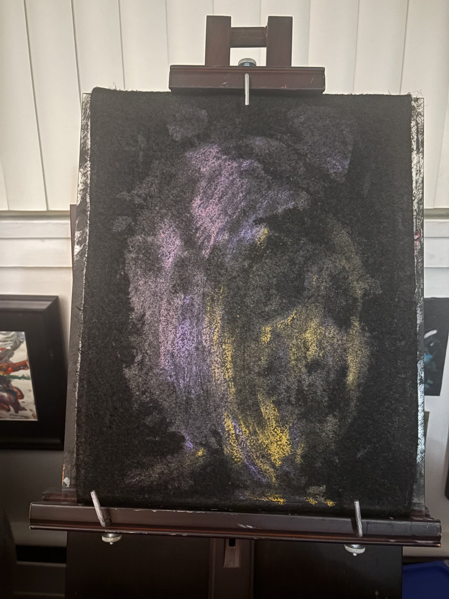 | [AG (untitled)](docs/paintings/ag-untitled.md) | ei9h7 | [Commit](https://github.com/ei9h7/paintings/commit/2710ac37131f210880932d7f796e51b3ca5f1875) |
| 2 | 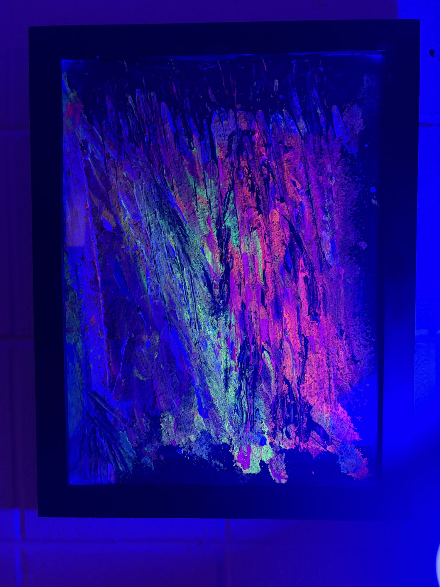 | [Lichen](docs/paintings/lichen.md) | ei9h7 | [Commit](https://github.com/ei9h7/paintings/commit/2f409edbfe91ed05db7f37c883a964cee6f65273) |
| 3 | 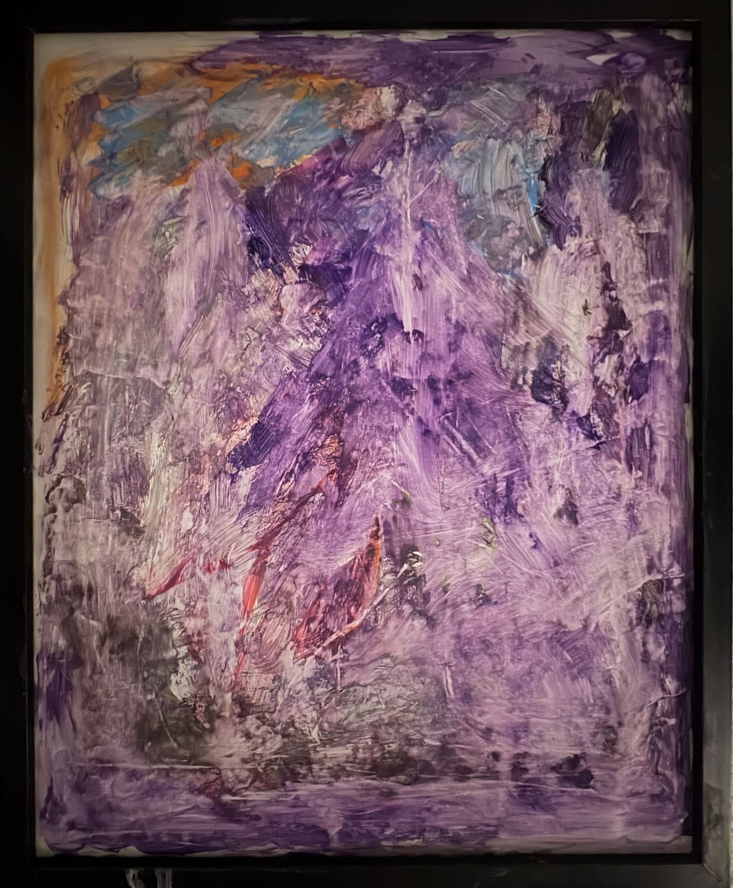 | [Painting Water](docs/paintings/painting-water.md) | HM & ei9h7 | [Commit](https://github.com/ei9h7/paintings/commit/6bc319a02cd3a7b025ead1bd6dee30db013449b6) |
| 4 | 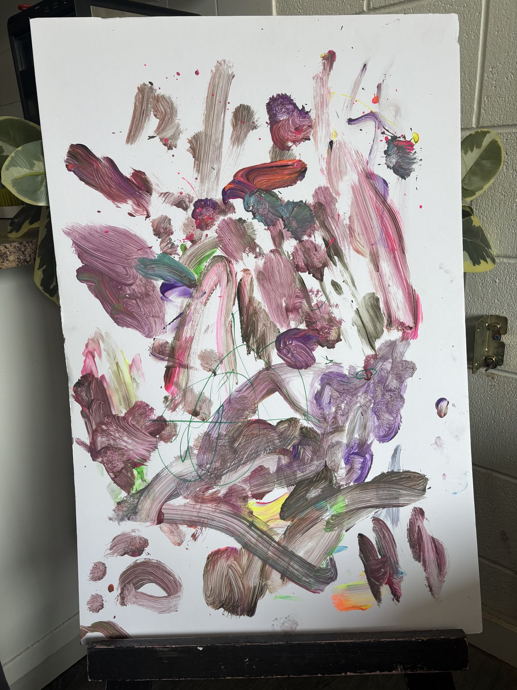 | [Reach](docs/paintings/reach.md) | HM & ei9h7 | [Commit](https://github.com/ei9h7/paintings/commit/742f884e33a43b63c2386335b678f3e282602470) |
| 5 | 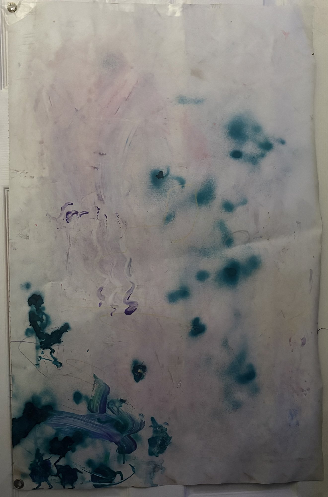 | [Blotted](docs/paintings/blotted.md) | HM | [Commit](https://github.com/ei9h7/paintings/commit/bd2d45d68687eb2790c0fb49bd9ca33ef460f77f) |
| 6 | 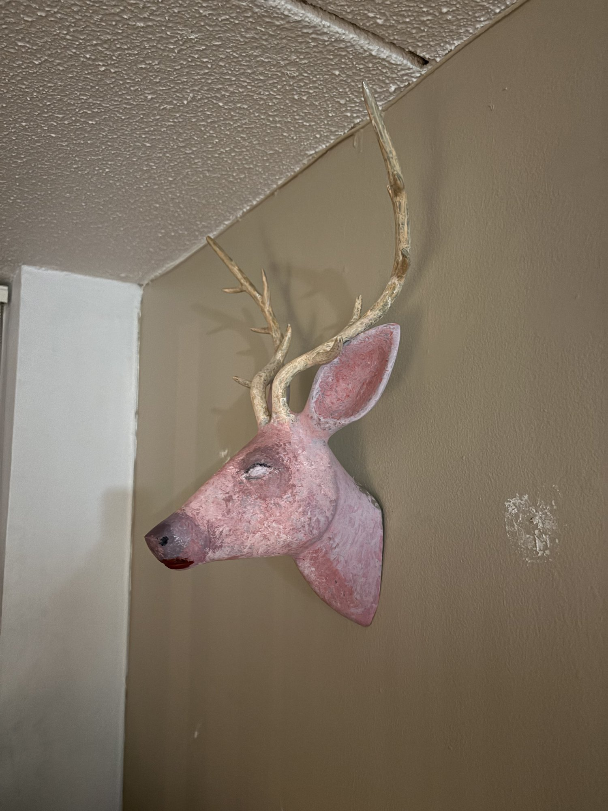 | [The Head](docs/paintings/the-head.md) | ei9h7 | [Commit](https://github.com/ei9h7/paintings/commit/a10634c206b222e5803199c7019925cf0901f7c7) |
| 7 | 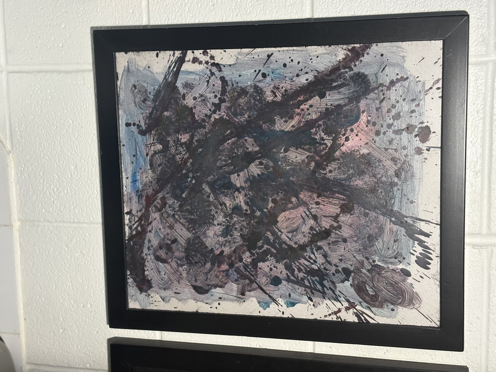 | [Unfinished Arguments](docs/paintings/unfinished-arguments.md) | ei9h7 | [Commit](https://github.com/ei9h7/paintings/commit/d609d599c7d8f461ca5e7d42269de9020543a397) |
| 8 | 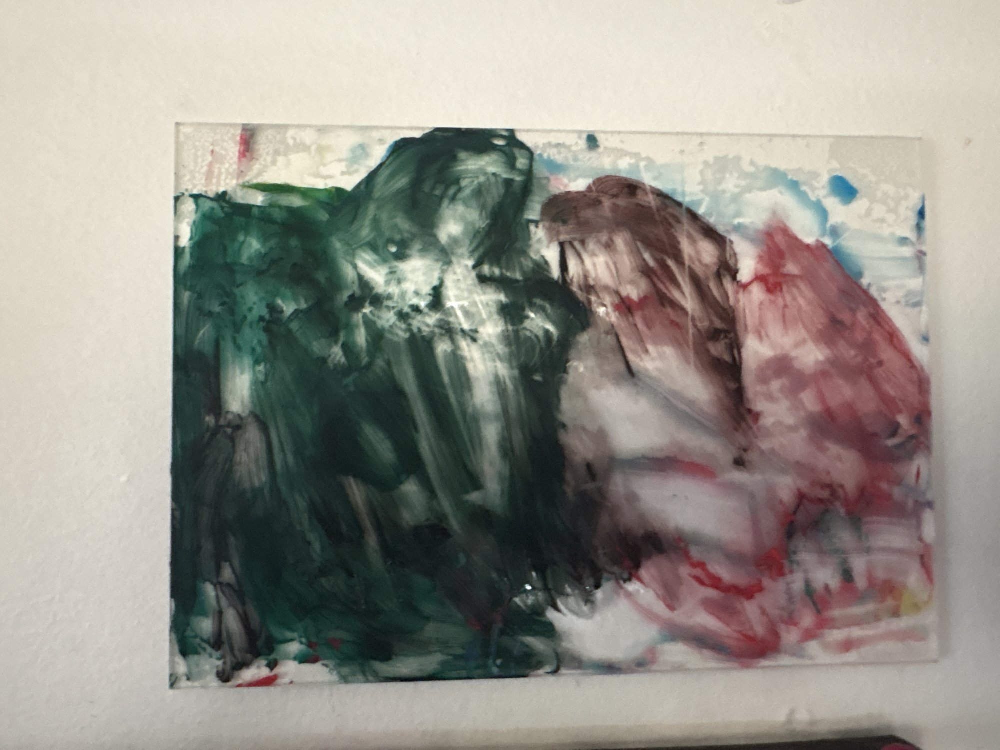 | [Together](docs/paintings/together.md) | HM | [Commit](https://github.com/ei9h7/paintings/commit/4f51b3c76e2800c2f53a77043e1fc05f0a3767dd) |
| 9 | 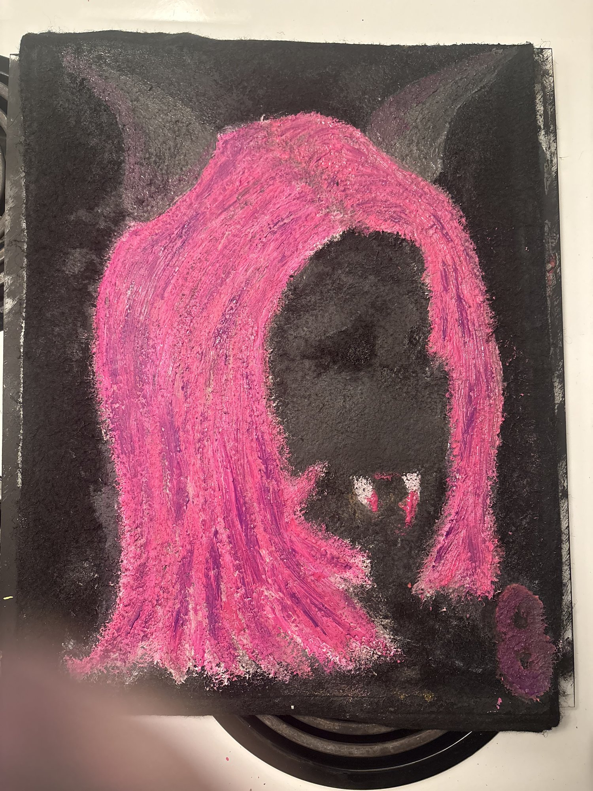 | [Trapped](docs/paintings/trapped.md) | ei9h7 | [Commit](https://github.com/ei9h7/paintings/commit/36abdf931545f18731c43e8dd4918319a6cd6160) |

## 🖼️ Collections & Compilations

### [Assorted Marbles](docs/paintings/collections.md#assorted-marbles)
A collection of multiple marbling pieces consolidated together.  
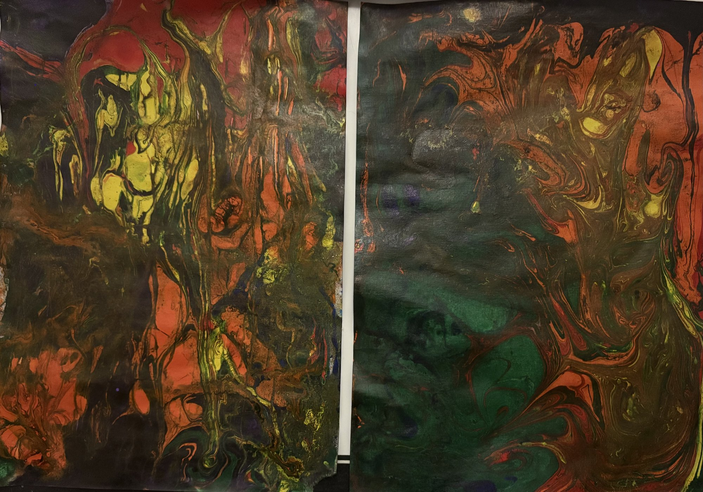  
**Artist:** HM & ei9h7  
[View Collection](https://github.com/ei9h7/paintings/commit/85d955a273a7a30e77f574dc00ad5140e2c9fd71)

### [Pairings](docs/paintings/collections.md#pairings)
Paintings displayed and arranged together, showing works in conversation with each other.  
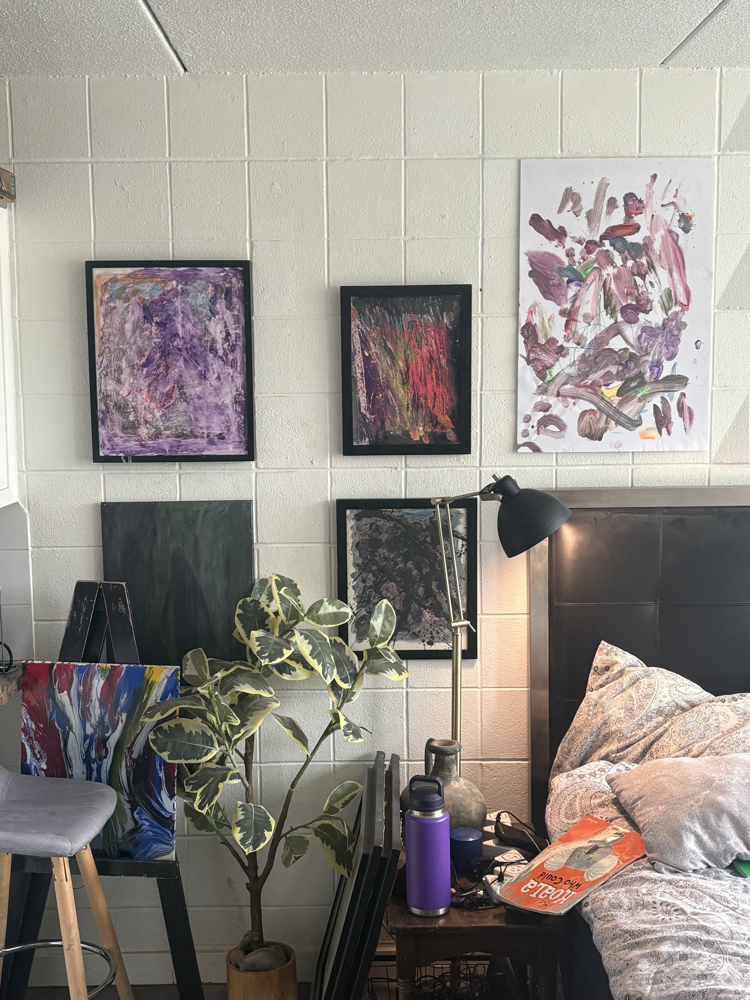  
**Artist:** ei9h7  
[View Display](https://github.com/ei9h7/paintings/commit/e8f93caeb7cca1b2c731cddf8c8ab3b34d8b2a6c)

## 📚 Documentation & Analysis

- **[Analysis Overview](docs/analysis-overview.md)** - Thematic and artistic analysis of the full collection
- **[Individual Painting Analyses](docs/paintings/)** - Deep dives into each work
- **[Collections Analysis](docs/paintings/collections.md)** - Exploration of Assorted Marbles and Pairings

## 📊 Collection Overview

- **Individual Paintings:** 9
- **Collaborative Works:** 3 (Painting Water, Reach, Assorted Marbles)
- **Solo Works by ei9h7:** 4
- **Works by HM:** 2
- **Collections:** 2 (Assorted Marbles, Pairings)

## 👥 Artists

### ei9h7
Primary artist in this collection with solo and collaborative pieces exploring various themes and styles. Works span from representational portraiture to abstract experimentation with process-driven techniques.

### HM
Collaborator on multiple pieces, contributing to both individual and joint works. Brings complementary artistic approaches to collaborative exploration.

---

## 💡 How to Browse

1. **Individual Paintings** - Click any title to read detailed analysis
2. **View Images** - Hover over thumbnails to see full-size images
3. **Visit Commits** - Click "Commit" links to see all documentation photos of each work
4. **Collections** - Browse curated groupings and compilations
5. **[Analysis Overview](docs/analysis-overview.md)** - Start here for thematic context

---

**Last Updated:** August 16, 2026  
**Repository:** [ei9h7/paintings](https://github.com/ei9h7/paintings)
